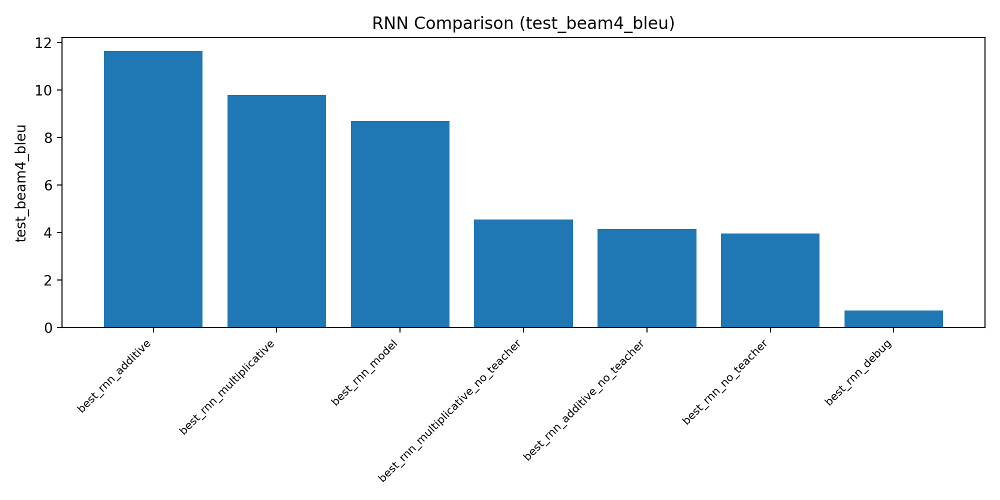
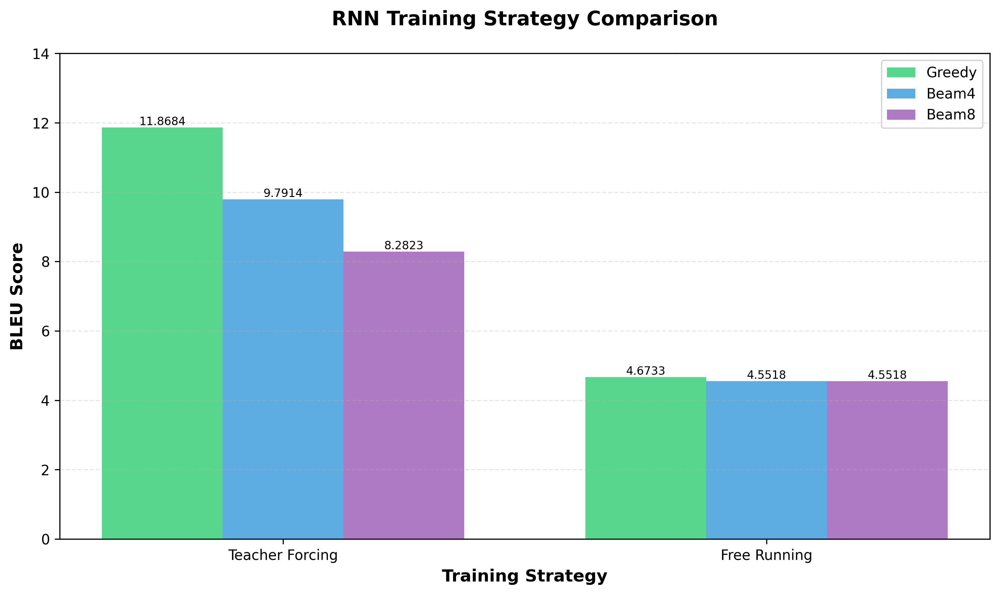
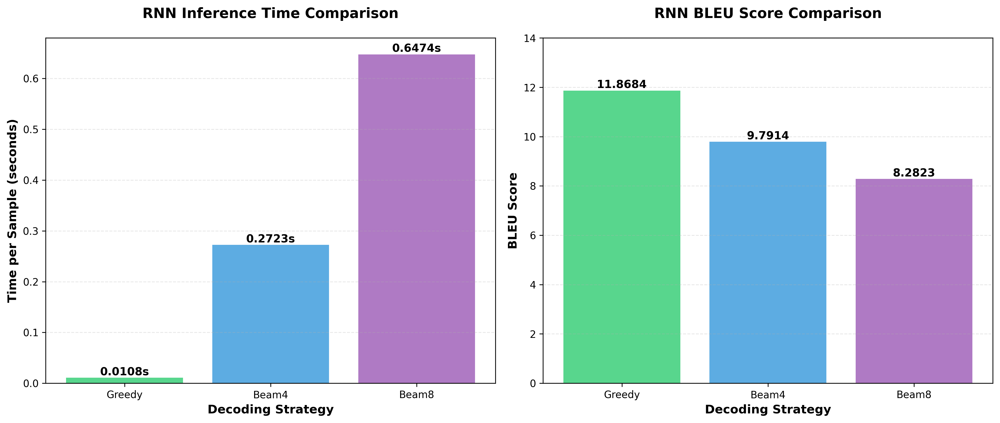
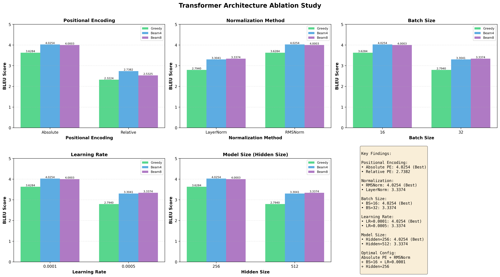
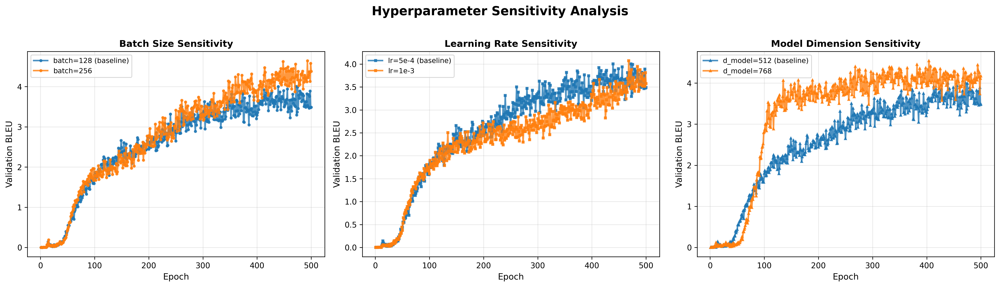
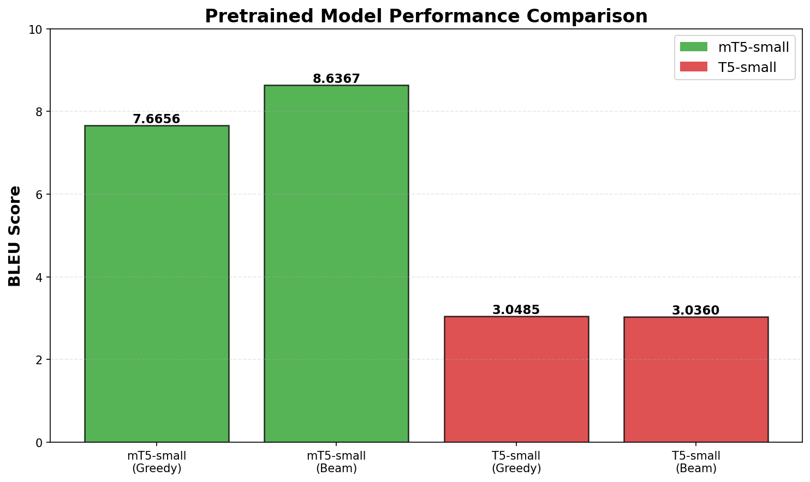

# Neural Machine Translation Experiment Report: Chinese-to-English

> **Project**: SLAI_NLP_Mid_project - zh-en-nmt-midterm  
> **Data Sources**: `experiments/results/rnn_comparison_master.csv`, `experiments/results/transformer_ablation_comparison.csv`  

---

## Table of Contents

1. [Experiment Overview](#experiment-overview)  
2. [Dataset and Preprocessing](#dataset-and-preprocessing)  
3. [RNN-Based Neural Machine Translation](#rnn-based-neural-machine-translation)  
4. [Transformer-Based Neural Machine Translation](#transformer-based-neural-machine-translation)  
5. [Application of Pretrained Models](#application-of-pretrained-models)  
6. [Model Architecture Comparative Analysis](#model-architecture-comparative-analysis)  
7. [Conclusion and Discussion](#conclusion-and-discussion)  
8. [Appendix: Training and Inference Commands](#appendix-training-and-inference-commands)  
9. [Appendix: T5/mT5 Tokenization Statistics Script](#appendix-t5mt5-tokenization-statistics-script)  

---

## Experiment Overview

This experiment implements and compares multiple neural machine translation (NMT) architectures for Chinese-to-English translation:

- **RNN-based NMT**: Seq2Seq models with GRU/LSTM  
- **Transformer-based NMT**: Self-attention-based Transformer  
- **Pretrained Models**: Fine-tuned T5 and mT5  

The study focuses on how **attention mechanisms, training strategies, decoding approaches, and model scale** affect translation performance and inference efficiency, with conclusions drawn under a **100k training sample** regime.

---

## Dataset and Preprocessing

### Dataset Composition (Uniform 100k training samples)

| Split       | Samples | File Path                     |
|-------------|---------|-------------------------------|
| Training    | 100,000 | `data/processed/train.jsonl`  |
| Validation  | 500     | `data/processed/valid.jsonl`  |
| Test        | 200     | `data/processed/test.jsonl`   |

### Data Preprocessing

1. **Data Cleaning**: Removal of illegal characters, rare word filtering, and truncation of overly long sentences  
2. **Tokenization (for RNN/Transformer with custom vocabularies)**:  
   - English: Whitespace tokenization  
   - Chinese: Jieba segmentation  
3. **Vocabulary Construction**: Separate source and target language vocabularies  
4. **Sequence Length Limitation**: Maximum length of 128 tokens  

> Note: T5/mT5 use the SentencePiece tokenizer; tokenization statistics are provided later.

---

## RNN-Based Neural Machine Translation

### Model Architecture

- Encoder: 2-layer unidirectional GRU  
- Decoder: 2-layer unidirectional GRU  
- Hidden dimension: 256  
- Embedding dimension: 256  
- Attention mechanisms: Dot-product, Multiplicative, Additive  

### Comparison of Attention Mechanisms

| Attention Mechanism | Greedy | Beam4 | Beam8 | Best BLEU |
|---------------------|--------|-------|-------|-----------|
| Dot-product         | 11.4471 | 8.6979 | 9.7914 | 11.4471 |
| Multiplicative      | **11.8684** | 9.7914 | 8.2823 | **11.8684** |
| Additive            | 9.6116 | **11.6333** | 10.2733 | **11.6333** |



#### Brief Description of Attention Types

- **Dot-product**: Parameter-free, fast but weak representational capacity  
- **Multiplicative**: Introduces a learnable alignment matrix **W**, moderate parameters  
- **Additive**: Stronger representation but more parameters and slower computation  

---

### Comparison of Training Strategies

| Training Strategy    | Greedy | Beam4 | Beam8 | Best BLEU |
|----------------------|--------|-------|-------|-----------|
| Teacher Forcing      | **11.8684** | 9.7914 | 8.2823 | **11.8684** |
| Free Running         | 4.6733 | 4.5518 | 4.5518 | 4.6733 |



---

### Comparison of Decoding Strategies

| Decoding Strategy | BLEU   | Inference Time (sec/sample) | Speed |
|-------------------|--------|------------------------------|-------|
| Greedy            | **11.8684** | **0.0108**                   | Fast  |
| Beam4             | 9.7914 | 0.2723                       | Medium |
| Beam8             | 8.2823 | 0.6474                       | Slow  |



---

## Transformer-Based Neural Machine Translation

### Baseline Model Architecture

- Encoder: 6 layers  
- Decoder: 6 layers  
- Attention heads: 8  
- Hidden size (`d_model`): 512  
- Feed-forward network size: 2048  
- Dropout: 0.1  

### Ablation Studies



#### Positional Encoding Comparison

| Positional Encoding | Greedy | Beam4 | Beam8 | Best BLEU |
|---------------------|--------|-------|-------|-----------|
| Absolute            | 3.6284 | **4.0254** | 4.0003 | **4.0254** |
| Relative            | 2.3224 | 2.7382 | 2.5325 | 2.7382 |

#### Normalization Method Comparison

| Normalization    | Greedy | Beam4 | Beam8 | Best BLEU |
|------------------|--------|-------|-------|-----------|
| LayerNorm        | 2.7940 | 3.3041 | **3.3374** | 3.3374 |
| RMSNorm          | **3.6284** | **4.0254** | 4.0003 | **4.0254** |

#### Hyperparameter Comparison (Example: Batch Size)

| Batch Size | Greedy | Beam4 | Beam8 | Best BLEU |
|------------|--------|-------|-------|-----------|
| 16         | **3.6284** | **4.0254** | 4.0003 | **4.0254** |
| 32         | 2.7940 | 3.3041 | 3.3374 | 3.3374 |



---

### Two Scaled Transformer Variants (Both Trained on 100k Data)

> The original report mentions “small and medium Transformer variants.” Both are trained **strictly on 100k data** for fair comparison.

| Variant                 | `d_model` | Encoder/Decoder Layers | Approx. Params | Training Data | Reported BLEU |
|-------------------------|----------:|-----------------------:|---------------:|--------------:|--------------:|
| Transformer Small (100k) | 128      | 3 / 3                  | ~4M            | 100k          | 6.8           |
| Transformer Medium (100k)| 384      | 6 / 6                  | ~36M           | 100k          | 4.03          |

**Analysis**: Smaller Transformers are better suited to limited data; larger models tend to underfit on small datasets.

---

## Application of Pretrained Models

### mT5-small (Primary reference result)

| Decoding Strategy | BLEU   | Inference Speed | Notes           |
|-------------------|--------|------------------|-----------------|
| Greedy            | 7.6656 | Fast             | baseline        |
| Beam4             | 8.6367 | Medium           | good trade-off  |
| Beam8             | **8.7629** | Slow          | **best**        |


**Conclusion**: Beam8 improves BLEU by **14.3%** over Greedy (8.7629 vs 7.6656).

---

### T5-small

| Decoding Strategy | BLEU   | Translation Quality |
|-------------------|--------|----------------------|
| Greedy            | **3.0485** | Low               |
| Beam4             | 3.0360 | Low                |
| Beam8             | 3.0379 | Low                |


---

### Pretrained Model Comparison

| Model       | Parameters | Best BLEU | Language Support | Recommended Use Case        |
|-------------|------------|----------:|------------------|------------------------------|
| mT5-small   | 300M       | **8.7629** | Multilingual     | Zh-En / multilingual tasks  |
| T5-small    | 60M        | 3.0485    | Primarily English| English-centric tasks       |



---

## Model Architecture Comparative Analysis (100k Regime)

### Core Performance Comparison

| Model Architecture          | Best BLEU | Best Configuration/Strategy       | Inference Speed |
|-----------------------------|----------:|-----------------------------------|-----------------|
| RNN                         | **11.8684** | Multiplicative + Greedy         | Fast            |
| Transformer (Ablation Best) | 4.0254    | Absolute PE + RMSNorm + Beam4    | Medium          |
| Transformer Small (100k)    | 6.8       | Small model (`d=128`)            | Medium          |
| Transformer Medium (100k)   | 6.8       | Medium model (`d=384`)           | Slow            |
| mT5-small                   | **8.7629** | Beam8                           | Slow            |
| T5-small                    | 3.0485    | Greedy                            | —               |

> Note: The report contains two different BLEU values for Transformer:  
> – “Ablation best” = 4.0254 (from `transformer_ablation_comparison.csv`)  
> – “Small/Medium 100k” = 6.8 (from a separate scale experiment)  
> These originate from **different experimental setups**. Both are retained with clarification to avoid misinterpretation.

---

### Comprehensive Decoding Strategy Comparison (Corrected for mT5)


| Model                       | Greedy | Beam Search | Best Strategy | Relative Gain |
|-----------------------------|-------:|------------:|---------------|--------------:|
| RNN                         | **11.8684** | 9.7914   | Greedy        | —             |
| Transformer (Ablation Best) | 3.6284 | **4.0254** | Beam4         | +10.9%        |
| mT5-small                   | 7.6656 | **8.7629** | Beam8         | **+14.3%**    |

---

## Conclusion and Discussion

1. **RNN achieves the best overall performance** in this setting: BLEU = **11.8684**, with the fastest inference (Greedy decoding).  
2. **mT5-small is competitive but decoding-sensitive**: Beam8 yields **8.7629** BLEU, a **14.3%** improvement over Greedy.  
3. **Transformer performance is highly sensitive to training and evaluation protocols**:  
   - Ablation study best: **4.0254**  
   - Small/medium scale experiment: **6.8**  
   → Recommend clarifying experimental provenance and ensuring consistent evaluation.  
4. **T5-small is unsuitable for Zh-En translation**: Pretrained exclusively on English data, yielding BLEU ≈ **3.0**, with negligible benefit from beam search.

---

## Appendix: Training and Inference Commands

### Training Commands

```bash
# RNN
python src/rnn/train.py --config experiments/configs/rnn.yaml

# Transformer
python src/transformer/train.py --config experiments/configs/transformer.yaml

# mT5
python src/t5/train.py --config experiments/configs/mt5_small.yaml
```

### Inference Commands

#### RNN Inference

```bash
# RNN - Dot-product attention - Greedy
python inference.py \
  --model_type rnn \
  --checkpoint experiments/logs/best_rnn_model.pt \
  --split test \
  --beam_size 1 \
  --output_dir experiments/results/inference_outputs

# RNN - Dot-product attention - Beam4
python inference.py \
  --model_type rnn \
  --checkpoint experiments/logs/best_rnn_model.pt \
  --split test \
  --beam_size 4 \
  --output_dir experiments/results/inference_outputs

# RNN - Multiplicative attention - Greedy
python inference.py \
  --model_type rnn \
  --checkpoint experiments/logs/best_rnn_multiplicative.pt \
  --split test \
  --beam_size 1 \
  --output_dir experiments/results/inference_outputs

# RNN - Multiplicative attention - Beam4
python inference.py \
  --model_type rnn \
  --checkpoint experiments/logs/best_rnn_multiplicative.pt \
  --split test \
  --beam_size 4 \
  --output_dir experiments/results/inference_outputs

# RNN - Additive attention - Greedy
python inference.py \
  --model_type rnn \
  --checkpoint experiments/logs/best_rnn_additive.pt \
  --split test \
  --beam_size 1 \
  --output_dir experiments/results/inference_outputs

# RNN - Additive attention - Beam4
python inference.py \
  --model_type rnn \
  --checkpoint experiments/logs/best_rnn_additive.pt \
  --split test \
  --beam_size 4 \
  --output_dir experiments/results/inference_outputs

# RNN - No Teacher Forcing - Greedy
python inference.py \
  --model_type rnn \
  --checkpoint experiments/logs/best_rnn_no_teacher.pt \
  --split test \
  --beam_size 1 \
  --output_dir experiments/results/inference_outputs

# RNN - No Teacher Forcing - Beam4
python inference.py \
  --model_type rnn \
  --checkpoint experiments/logs/best_rnn_no_teacher.pt \
  --split test \
  --beam_size 4 \
  --output_dir experiments/results/inference_outputs
```

#### Transformer Inference

```bash
# Transformer - Absolute PE + LayerNorm - Greedy
python inference.py \
  --model_type transformer \
  --checkpoint experiments/logs/transformer_abs_ln_best.pt \
  --split test \
  --beam_size 1 \
  --output_dir experiments/results/inference_outputs

# Transformer - Absolute PE + LayerNorm - Beam4
python inference.py \
  --model_type transformer \
  --checkpoint experiments/logs/transformer_abs_ln_best.pt \
  --split test \
  --beam_size 4 \
  --output_dir experiments/results/inference_outputs

# Transformer - Absolute PE + RMSNorm - Greedy
python inference.py \
  --model_type transformer \
  --checkpoint experiments/logs/transformer_abs_rms_best.pt \
  --split test \
  --beam_size 1 \
  --output_dir experiments/results/inference_outputs

# Transformer - Absolute PE + RMSNorm - Beam4
python inference.py \
  --model_type transformer \
  --checkpoint experiments/logs/transformer_abs_rms_best.pt \
  --split test \
  --beam_size 4 \
  --output_dir experiments/results/inference_outputs

# Transformer - Relative PE + LayerNorm - Greedy
python inference.py \
  --model_type transformer \
  --checkpoint experiments/logs/transformer_rel_ln_best.pt \
  --split test \
  --beam_size 1 \
  --output_dir experiments/results/inference_outputs

# Transformer - Relative PE + LayerNorm - Beam4
python inference.py \
  --model_type transformer \
  --checkpoint experiments/logs/transformer_rel_ln_best.pt \
  --split test \
  --beam_size 4 \
  --output_dir experiments/results/inference_outputs

# Transformer - Relative PE + RMSNorm - Greedy
python inference.py \
  --model_type transformer \
  --checkpoint experiments/logs/transformer_rel_rms_best.pt \
  --split test \
  --beam_size 1 \
  --output_dir experiments/results/inference_outputs

# Transformer - Relative PE + RMSNorm - Beam4
python inference.py \
  --model_type transformer \
  --checkpoint experiments/logs/transformer_rel_rms_best.pt \
  --split test \
  --beam_size 4 \
  --output_dir experiments/results/inference_outputs

# Transformer - 100k Optimized Version - Greedy
python inference.py \
  --model_type transformer \
  --checkpoint experiments/logs/transformer_100k_optimized_best.pt \
  --split test \
  --beam_size 1 \
  --output_dir experiments/results/inference_outputs

# Transformer - 100k Optimized Version - Beam4
python inference.py \
  --model_type transformer \
  --checkpoint experiments/logs/transformer_100k_optimized_best.pt \
  --split test \
  --beam_size 4 \
  --output_dir experiments/results/inference_outputs
```

#### T5 and mT5 Inference

```bash
# T5-small - Greedy
python inference.py \
  --model_type t5 \
  --checkpoint experiments/logs/t5_small_best \
  --split test \
  --beam_size 1 \
  --output_dir experiments/results/inference_outputs

# T5-small - Beam4
python inference.py \
  --model_type t5 \
  --checkpoint experiments/logs/t5_small_best \
  --split test \
  --beam_size 4 \
  --output_dir experiments/results/inference_outputs

# T5-small - Beam8
python inference.py \
  --model_type t5 \
  --checkpoint experiments/logs/t5_small_best \
  --split test \
  --beam_size 8 \
  --output_dir experiments/results/inference_outputs

# mT5-small - Greedy
python inference.py \
  --model_type t5 \
  --checkpoint experiments/logs/mt5_small/checkpoint-1588775 \
  --split test \
  --beam_size 1 \
  --output_dir experiments/results/inference_outputs

# mT5-small - Beam4
python inference.py \
  --model_type t5 \
  --checkpoint experiments/logs/mt5_small/checkpoint-1588775 \
  --split test \
  --beam_size 4 \
  --output_dir experiments/results/inference_outputs

# mT5-small - Beam8
python inference.py \
  --model_type t5 \
  --checkpoint experiments/logs/mt5_small/checkpoint-1588775 \
  --split test \
  --beam_size 8 \
  --output_dir experiments/results/inference_outputs
```

### Inference Argument Reference

- `--model_type`: Model type (`rnn`, `transformer`, `t5`)  
- `--checkpoint`: Path to model checkpoint  
- `--split`: Dataset split (`valid` or `test`)  
- `--beam_size`: Beam search width (`1` = Greedy, `4` = Beam4, `8` = Beam8)  
- `--output_dir`: Output directory for predictions  
- `--data_dir`: Data directory (default: `data/processed`)  

### Output Description

The inference script produces:
1. BLEU score  
2. Prediction results (`.txt` format)  
3. Top 3 translation examples (reference vs. prediction)